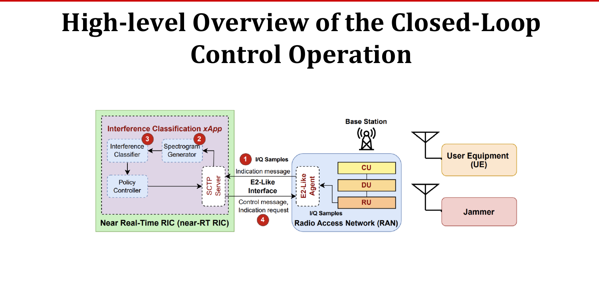
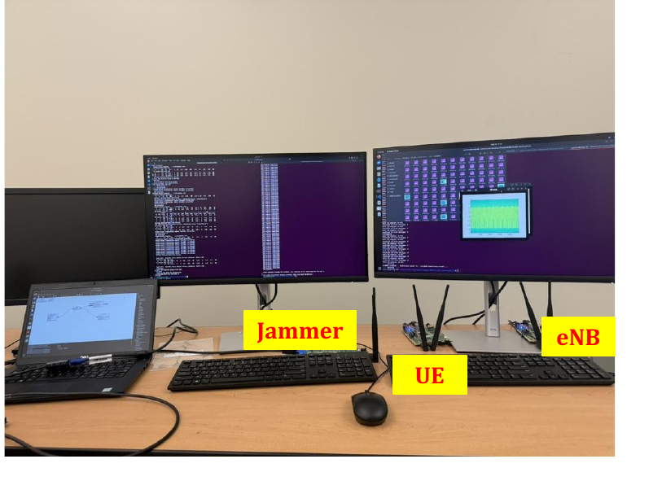
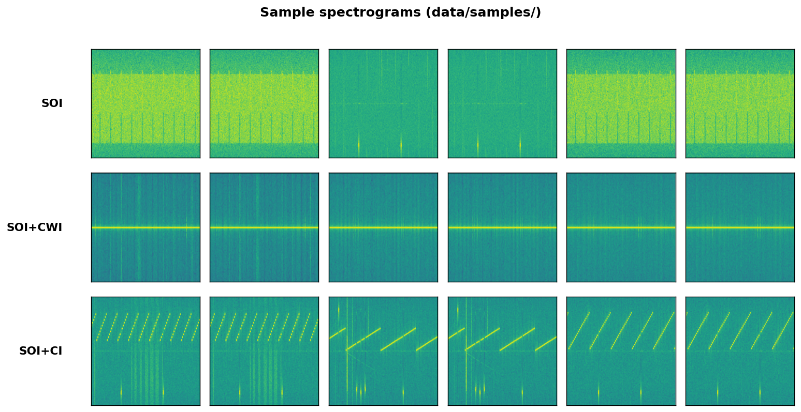
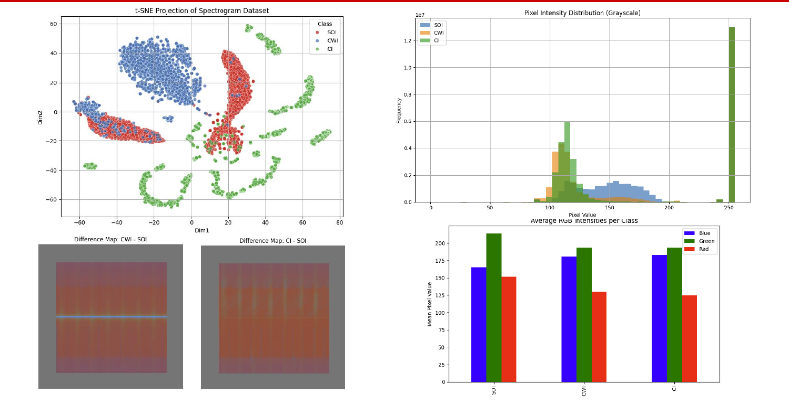
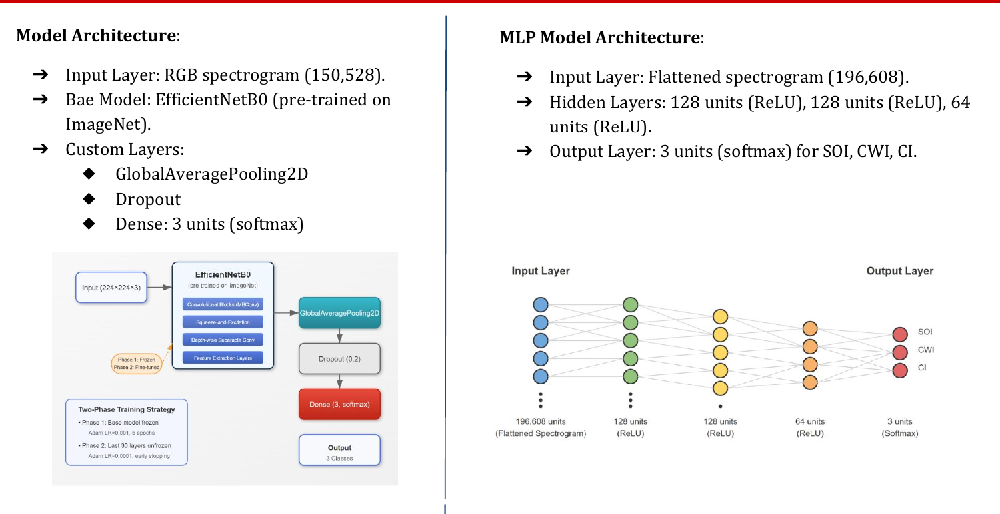
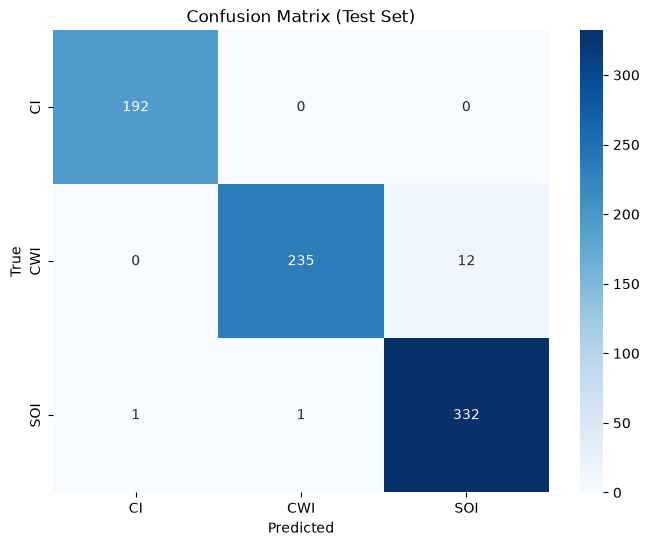
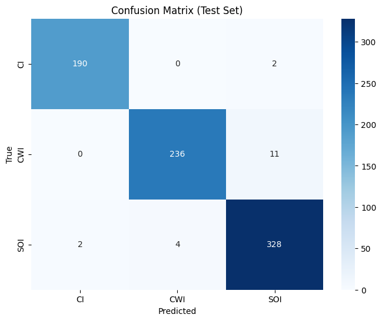

# Interference Detection and Classification in Open RAN Using Neural Networks

A neural-network **xApp** that detects and classifies RF interference (jamming) from
channel spectrograms in an LTE **O-RAN** testbed, fast enough to drive a near-real-time
RIC (near-RT RIC) closed-loop mitigation. The classifier distinguishes a clean signal of
interest from two common jamming waveforms, so the RIC can react (e.g. switch to a more
robust modulation scheme) within the **10 ms – 1 s** control-loop window.

> Course project — NC State University, **ECE 542** (Group 9): Abiodun Ganiyu, Osman Mamudu, Ta-seen Niloy.
> The full slide deck is in [`docs/542-EDA-presentation.pdf`](docs/542-EDA-presentation.pdf).

---

## Problem

In O-RAN, real-time interference detection is key to QoS. We frame detection as a
3-class image-classification problem over channel **spectrograms**:

| Class       | Meaning                                            |
|-------------|----------------------------------------------------|
| **SOI**     | Signal of interest only — no interference          |
| **SOI+CWI** | SOI + **C**ontinuous-**W**ave **I**nterference     |
| **SOI+CI**  | SOI + **C**hirped **I**nterference                 |

The challenge is balancing **classification accuracy** against **inference latency** under
the strict near-RT RIC timing budget.

## System overview

I/Q samples are pulled from the RAN over an E2-like interface, turned into spectrogram
images, and classified by the xApp; the predicted class feeds a policy controller that
triggers mitigation.



### Testbed

The dataset was generated from a custom LTE **O-RAN testbed built on a modified
[srsRAN](https://github.com/srsran) stack** (open-source 4G), with a separate SDR acting
as the jammer (CWI / chirped) alongside the eNB and UE.



## Dataset

- **Input:** RGB spectrogram images (visual representation of the channel), ~6,000 images
  balanced across the three classes.
- **Split:** 70 % train / 20 % validation / 10 % test.
- **Source:** generated externally from the srsRAN-based testbed above. **The dataset is
  not bundled with this repo.** To run the notebooks, point `directory` at a folder with
  one sub-folder per class:

  ```
  cleaned/
  ├── CI/      # SOI + chirped interference
  ├── CWI/     # SOI + continuous-wave interference
  └── SOI/     # signal of interest only
  ```

A small illustrative subset (~6 images per class) is committed under
[`data/samples/`](data/samples) so you can see the model inputs without the full dataset.
Rebuild this grid after adding or changing images with `python scripts/make_sample_grid.py`:



Representative spectrograms per class (top), and exploratory analysis — t-SNE,
pixel-intensity distributions, per-class RGB means, and class difference maps (bottom),
from the project presentation:




## Models

Two models were trained and compared — a heavier transfer-learning CNN and a lightweight
MLP baseline that trades a little accuracy for much lower latency.



| | **EfficientNetB0** ([`notebooks/efficientnet_b0.ipynb`](notebooks/efficientnet_b0.ipynb)) | **MLP baseline** ([`notebooks/mlp_spectrogram.ipynb`](notebooks/mlp_spectrogram.ipynb)) |
|---|---|---|
| Input | 224 × 224 × 3 (RGB) | flattened spectrogram (scaled to `[0,1]`) |
| Architecture | EfficientNetB0 (ImageNet) → GlobalAveragePooling2D → Dropout(0.2) → Dense(3, softmax) | Dense(128) → Dense(128) → Dense(64) → Dense(3, softmax), ReLU |
| Augmentation | random horizontal flip + brightness | none |
| Training | 2 phases: frozen base (Adam 1e-3, 5 ep) → fine-tune last 30 layers (Adam 1e-4, early stopping) | Adam 1e-4, sparse categorical cross-entropy, 10 epochs |

Both notebooks run on Google Colab or locally in Jupyter Lab.

## Results

Measured on the held-out test set (773 images: 192 CI / 247 CWI / 334 SOI) using the
leak-free split described under [Known limitations](#known-limitations).

| Model | Accuracy | Precision | Recall | F1 | Avg. inference time¹ |
|---|---|---|---|---|---|
| EfficientNetB0 | 0.9819 | 0.9852 | 0.9818 | 0.9833 | ~16.6 ms (local CPU) |
| MLP baseline   | 0.9754 | 0.9783 | 0.9757 | 0.9769 | ~0.38 ms (Colab) |

¹ Inference time is hardware-dependent, and the two rows were measured on different
machines (EfficientNet on a local Windows CPU with no GPU; MLP on Google Colab), so treat
it as indicative rather than a controlled comparison. Both sit within the near-RT RIC
control-loop budget (10 ms – 1 s).

EfficientNetB0 is the more accurate model; the MLP gives up only ~0.6 points of accuracy
while being far lighter and much lower-latency — attractive when latency dominates.

Confusion matrices on the held-out test set:

<table>
<tr>
<td></td>
<td></td>
</tr>
<tr>
<td align="center"><em>EfficientNetB0</em></td>
<td align="center"><em>MLP baseline</em></td>
</tr>
</table>

## Repository layout

```
.
├── README.md
├── requirements.txt
├── notebooks/
│   ├── efficientnet_b0.ipynb       # EfficientNetB0 transfer-learning classifier
│   └── mlp_spectrogram.ipynb       # lightweight MLP baseline
├── scripts/
│   └── make_sample_grid.py         # rebuilds the sample-spectrogram figure
├── data/
│   └── samples/                    # ~6 illustrative spectrograms per class (CI/ CWI/ SOI/)
└── docs/
    ├── 542-EDA-presentation.pdf    # project presentation
    └── figures/                    # figures used in this README
```

## Running the notebooks

The notebooks are written for **Google Colab** (they mount Google Drive for the dataset).

1. Upload your spectrogram dataset to Drive in the class-folder layout shown above.
2. Open a notebook in Colab, set `directory` to your dataset path.
3. Run all cells (a GPU runtime is recommended for EfficientNet).

To run locally instead, remove the `from google.colab import drive` / `drive.mount(...)`
cell, point `directory` at a local path, and install the dependencies:

```bash
pip install -r requirements.txt
```

## Known limitations

- **Train/test split (fixed in this repo):** the original course notebooks split a single
  reshuffling dataset with `.take()/.skip()`, so the train/val/test sets overlapped —
  leaking data and **inflating the reported metrics** (the course deck quoted ~0.99+ for
  both models). The notebooks here use leak-free Keras `validation_split`/`subset`
  partitioning, and the table above reports those corrected, leak-free results.
- **Dataset not included** — generated from the testbed; bring your own.
- **Inference timing** is measured over a warm, batched `model.predict()` call and is
  hardware-dependent (see the table footnote), so treat it as an approximate per-image
  latency rather than an exact figure.
- The IQ → spectrogram generation pipeline (and the modified srsRAN code) lives in the
  testbed, not in this repo.

## References

1. N. H. Stephenson, A. J. Chiejina, N. B. Kabigting, and V. K. Shah,
   "Demonstration of Closed-Loop AI-Driven RAN Controllers Using O-RAN SDR Testbed,"
   *MILCOM 2023 — IEEE Military Communications Conference*, 2023, pp. 241–242.
2. A. Chiejina, B. Kim, K. Chowhdury, and V. K. Shah,
   "System-Level Analysis of Adversarial Attacks and Defenses on Intelligence in O-RAN
   Based Cellular Networks," *Proc. 17th ACM Conf. on Security and Privacy in Wireless and
   Mobile Networks (WiSec)*, 2024, pp. 237–247.

## License

Released under the [MIT License](LICENSE).
